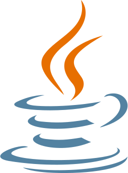
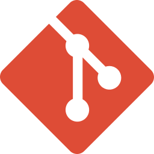

# Abdulaziz Alhuzami
Cybersecurity Student &bull; Audiophile &bull; Gamer

[Website](https://abdulazizhu.com) &bull; [CV](https://cv.abdulazizhu.com) &bull; [X](https://x.com/Azizif220) &bull; [LinkedIn](https://www.linkedin.com/in/abdulaziz-alhuzami/) &bull; [Instagram](https://www.instagram.com/abdulazizalhuzami/)

## Skills

### Programming Languages
&nbsp;&nbsp;&nbsp;&nbsp;&nbsp;&nbsp;

###

_**Note:** I'm currently learning Python_

### Tools & Environments
&nbsp;&nbsp;&nbsp;&nbsp;&nbsp;&nbsp;&nbsp;&nbsp;&nbsp;

## Badges

## Credits

- **Icons:** [theSVG](https://thesvg.org/)
- **Badges:** [Credly](https://www.credly.com/badges/2eff0fcb-c54a-4835-8add-97518ea0a645)
